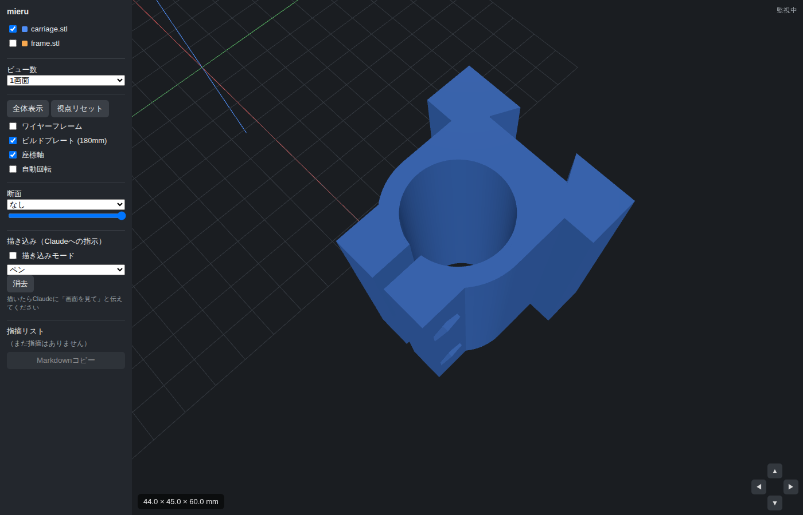

# heat-insert-press — ヒートインサート圧入治具

はんだごてを垂直に保持し、3Dプリント品にインサートナット（真鍮ヒートインサート）を
まっすぐ圧入するための治具です。スクリプト（JSCAD）からSTLを出力するタイプの
モデリング例で、mieruで表示確認しながらパラメータを調整できます。


## 構成（印刷部品2点）

| 部品 | 内容 |
| --- | --- |
| `frame.stl` | ベースプレート + 支柱 + オス側アリ溝レール（一体） |
| `carriage.stl` | メス側アリ溝で上下にスライドするキャリッジ。割りリングでこてを保持 |

キャリッジ上面図（中央がこて保持ボア、奥がアリ溝、手前が割りスリットとボルト耳）:



## 必要な市販部品

- 温度調整式はんだごて（例: TS100/TS101、Pinecil、白光FX-600）
- M4ボルト ×2（長さ30mm程度）+ M4ナット ×2 … クランプ締め付け用
- （任意）木ネジ ×4 … ベースを作業台に固定する場合（⌀4.5穴）
- （任意）輪ゴム … 未使用時にキャリッジを上で保持する用

## 使い方

```bash
cd examples/heat-insert-press
npm install
npm run build        # stl/frame.stl, stl/carriage.stl を出力
npm run assembly     # stl/assembly.stl（組立プレビュー、印刷不可）を出力
```

mieruで確認する場合（リポジトリルートで）:

```bash
node server.js examples/heat-insert-press/stl
```

## 組立と運用

1. キャリッジを支柱上端からアリ溝レールに差し込む
2. はんだごてを上からリングに通し、M4ボルト2本で軽く締めて固定
   （こて先がキャリッジ下端から3〜5cm出る位置が目安）
3. ワークをベース上のこて先直下に置き、インサートを穴に仮置き
4. こてを設定温度（真鍮インサート: PLA/PETGなら200〜250°C目安）にし、
   キャリッジごとゆっくり押し下げて圧入する

## パラメータ調整

`model.js` 冒頭の `P` を編集して `npm run build` で再生成します。主なもの:

- `ironDiameter` … こての保持部外径（**要実測**。初期値22.0mm）。
  クランプは割りリング式なので実測値ぴったりでよい
- `clearance` … アリ溝の摺動クリアランス（初期値0.3mm）。
  印刷後にきつい場合は0.4〜0.5mmへ
- `towerH` / `baseW` / `baseD` … 支柱高さとベース寸法

## 印刷の目安

- 向き: どちらの部品もSTLの向きのまま（自立する向き）で印刷
- 材料: PETG推奨（こての熱が伝わる可能性があるためPLAより耐熱性のあるもの）
- インフィル20〜30%、キャリッジは壁3周以上を推奨

## 注意

- こて先やヒーター部が直接触れる部分に樹脂部品が来ない構成ですが、
  長時間の連続使用ではクランプ部の温度に注意してください
- 本治具は個人のDIY用途を想定した設計例です。使用は自己責任でお願いします
