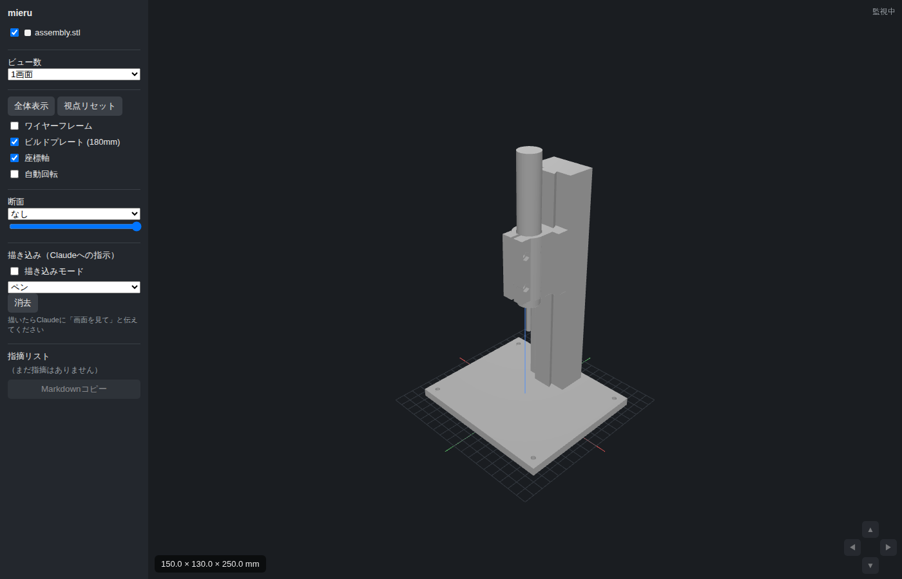
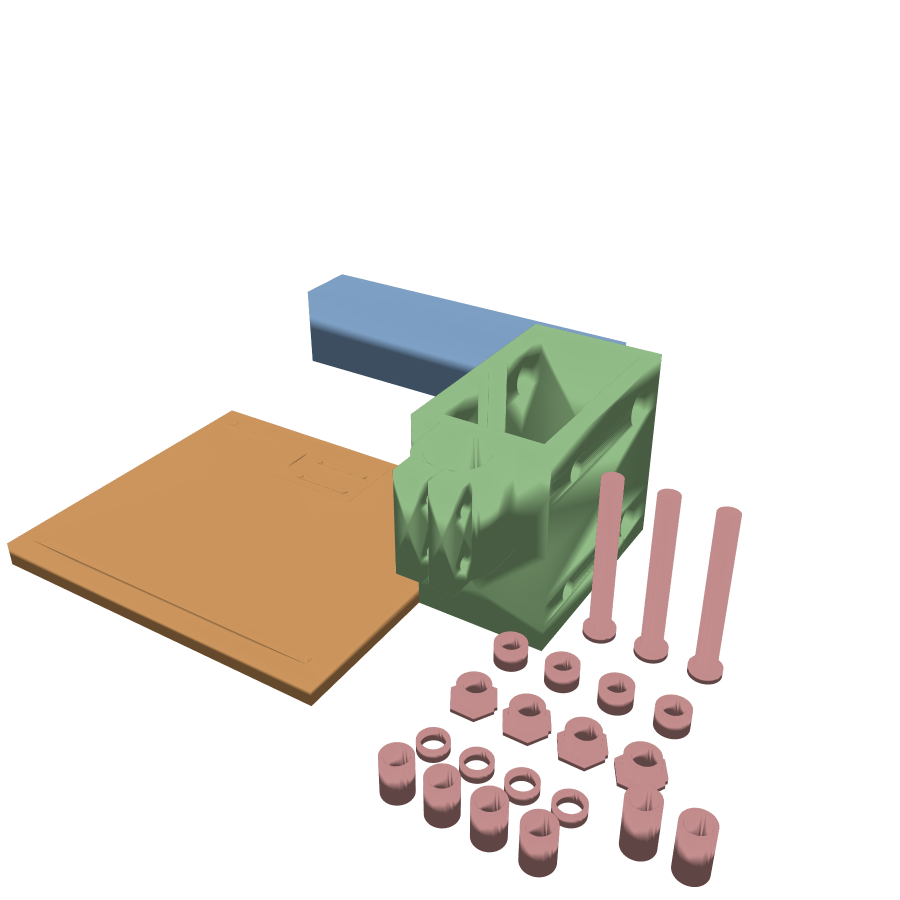

# heat-insert-press — ヒートインサート圧入治具

はんだごてを垂直に保持し、3Dプリント品にインサートナット（真鍮ヒートインサート）を
まっすぐ圧入するための治具です。スクリプト（JSCAD）からSTLを出力するタイプの
モデリング例で、mieruで表示確認しながらパラメータを調整できます。

対象プリンタは Bambu A1 mini（180×180×180mm）。全パーツがこの中に収まります。



## 設計方針: 摺動ではなく転がり、押さずに自重で

樹脂同士の摺動ガイドはスティックスリップ（静止摩擦＞動摩擦で起きるカクつき）が
避けられず、圧入の瞬間に「引っかかり→ガクッと落下」するとインサートが斜めに
入る原因になります。そのため本設計では:

- 案内は**608ZZベアリング6個の転がり**とし、摺動摩擦に頼らない
- 柱は**横倒しで印刷**する。転がり面（前後面）が側壁になるので積層線が進行方向に
  沿い、ベアリングが積層の筋を乗り越えずに済む。前後面の平行度もXY精度で出る
- 圧入の力は**キャリッジ＋こての自重**（約3N）。手で押さない。輪ゴムは待機時に
  キャリッジを上で保持する**パーキング専用**で、圧入中は外す（ゴムを掛けたまま
  下げると、伸びるほど張力が増えて押し付け力が減っていくため）
- 印刷公差によるガタは、背面軸の**偏心ブッシュ**（六角フランジを回すと
  ベアリング位置が±0.75mm動く）で組立後に調整する
- 締結はすべて **M3×20ねじ + 熱圧入インサート**。印刷ねじや別径のボルトは使わない

## 印刷部品



| 部品 | 数 | 内容 | 印刷向き |
| --- | --- | --- | --- |
| `base.stl` | 1 | ベースプレート（柱ポケット＋裏からのねじ穴） | そのまま |
| `tower.stl` | 1 | 角柱レール 40×30×168（天面に輪ゴムペグ） | **そのまま（横倒し）**。30mm幅の面が下 |
| `carriage.stl` | 1 | ベアリングスリーブ + こてクランプ（割りリング） | そのまま（直立） |
| `axles.stl` | 4 | ベアリング軸 ⌀7.85（頭付き） | そのまま（頭を下に直立）。ブリム推奨 |
| `caps.stl` | 4 | 軸の抜け止めキャップ（⌀7.6圧入穴） | そのまま |
| `bushings.stl` | 4 | 偏心ブッシュ（六角フランジ・偏心方向マーク付き） | そのまま |
| `spacers.stl` | 10 | ベアリング位置決めスペーサー 4.5mm ×4 / 19mm ×2 / 15mm ×4 | そのまま |

小物は種類ごとに1ファイルなので、必要な種類だけ印刷し直せます。

## 必要な市販部品

- 608ZZベアリング ×6（1個100円前後の汎用品）
- 温度調整式はんだごて（設計基準: YIHUA 928D-III。グリップ最太部⌀22.2mm実測）
- M3×20 なべ小ねじ ×6 + M3ヒートインサート（外径5.0×長さ4.0） ×6
  … クランプ2本 + 柱固定4本。下穴はすべて⌀4.7×深さ6.0（水平穴の垂れ込み分を含む）
- 輪ゴム … 待機時のパーキング用
- （任意）M8×70ボルト ×4 … 印刷軸の代わりに使うと剛性が上がる
- （任意）木ネジ ×4 … ベースを作業台に固定する場合（⌀4.5穴）

## 使い方

```bash
cd examples/heat-insert-press
npm install
npm run build        # 印刷用STL一式を stl/ に出力
npm run assembly     # stl/assembly.stl（組立プレビュー、印刷不可）を出力
```

mieruで確認する場合（リポジトリルートで）:

```bash
node server.js examples/heat-insert-press/stl
```

## 組立

1. **インサート圧入**（治具完成前の最後の手作業。手持ちのこてで普通に入れる）:
   柱の下端面に4個、キャリッジ右耳（+X側）の外面に2個
2. 柱をベースのポケットに差し込み、ベース裏からM3×20を4本締める
   （頭は座繰りに沈むのでベースは平らに据わる）
3. 前面2軸: 軸を側壁に通しながら「スペーサー4.5 → ベアリング → スペーサー19 →
   ベアリング → スペーサー4.5」の順に通し、キャップで留める
4. 背面2軸: 側壁の⌀12.6穴に偏心ブッシュを外側から差し込み、軸を通しながら
   「スペーサー15 → ベアリング → スペーサー15」を通し、キャップで留める。
   **左右のブッシュはフランジの切り欠き（偏心方向）を同じ向きに揃える**。
   ずれると軸が首を振り、ベアリングが柱に片当たりする
5. キャリッジを柱の上端からかぶせて下ろす（天面のペグは柱の断面内に収まる）
6. 偏心ブッシュを左右同時に回して、ガタがなく・軽く転がる位置に調整する
   （固い場合はブッシュを少し戻す。調整後は瞬間接着剤を一滴垂らすと保持が安定）
7. はんだごてを上からリングに通し、M3×20ねじ2本で軽く締めて固定。
   リング（高さ40mm）はグリップの直胴区間（47.5mm）に収まる。操作ボタンや
   LED表示を覆わない位置で締めること
8. 待機時は輪ゴムを柱天面のペグとキャリッジ右側面のペグに掛けて上で保持する

## 圧入のしかた

1. ワークをベース上のこて先直下に置き、インサートを穴に仮置き
2. こてを設定温度にする（PETG・M3インサートなら200℃前後が目安）
3. 輪ゴムを外し、キャリッジを手で支えながらこて先をインサートに載せる。
   手を離して自重で沈むのを待つ（押さない）。インサートの上面がワーク面と
   揃ったらキャリッジを引き上げ、輪ゴムを掛ける

ワークの最大高さは約85mm（柱176mm − 上段ベアリング65 − リング下端40 − こて先長）。

## パラメータ調整

`model.js` 冒頭の `P` を編集して `npm run build` で再生成します。主なもの:

- `ironDiameter` … こてグリップ（ゴム部）の最太部（928D-III実測22.0〜22.2の最大値22.2）。
  ボアは `clampClear`（片側0.3mm）を足した⌀22.8で、割りを締めて詰める
- `ironFrontDiameter` … グリップ先端側プラスチック部の直径（928D-IIIはゴム部と同じ）。
  ゴム部より細いこてならここに入れると下側`frontLen`（15mm）のボアが段付きになる
- `ringH` … クランプリング高さ（初期値40mm）。グリップ直胴区間より短くすること
- `axleHole` / `bushHole` / `padGap` … 軸・ブッシュの穴径とガイドパッドの隙間。
  水平穴は印刷で上側が垂れるので、きつければ+0.1〜0.2
- `towerH` … 柱の長さ。天面ペグ10mm込みで180以下

## 印刷の目安

- 向き: すべてSTLの向きのまま。柱は横倒しのまま印刷する（立てない）。
  ⌀7.85軸（axles.stl）は垂直印刷なのでブリム推奨。強度が不安ならM8ボルトに置き換える
- 材料: PETG推奨（こての熱が伝わる可能性があるためPLAより耐熱性のあるもの）
- インフィル20〜30%、キャリッジは壁3周以上を推奨

## 注意

- こて先やヒーター部が直接触れる部分に樹脂部品が来ない構成ですが、
  長時間の連続使用ではクランプ部の温度に注意してください
- 本治具は個人のDIY用途を想定した設計例です。使用は自己責任でお願いします
